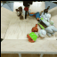
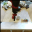
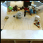
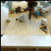
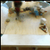
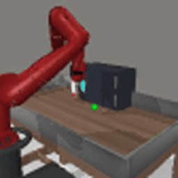
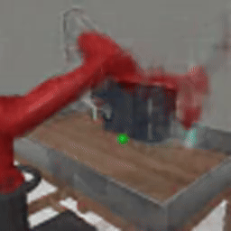

# Ego-Foresight
A self-supervised method for disentangling agent and scene based on motion and prediction which enables improved sample-efficiency and performance in RL.

# Agent Prediction on BAIR Dataset

### Grount truth | Prediction

 

### Grount truth | Prediction

 

# Video Generation on BAIR dataset

### Grount truth | Original trajectory | Handcrafted trajectory

 

# Solving robotic manipulation tasks in Metaworld

### Door open
### Solving the task | Prediction given 3 context frames and trajectory that solves the task 

 

### Hammer
### Solving the task | Prediction given 3 context frames and trajectory that solves the task 

 

